#  Traccar App -- Flutter

This app is a client for [Traccar](https://www.traccar.org/), an open-source GPS tracking platform. The app is built with Flutter and Dart.

## Platforms
* Android
* iOS
* Web
* Windows
* Linux
* macOS

## Features
* Dark mode
* Multiple map providers (Google Maps, OpenStreetMap, Carto, Stadia)
* Positions animation (play, pause, stop)
* Select time range of positions

## Register Traccar server
To use the app you need to set your Traccar server URL in the login screen.

## Screenshots
### Android
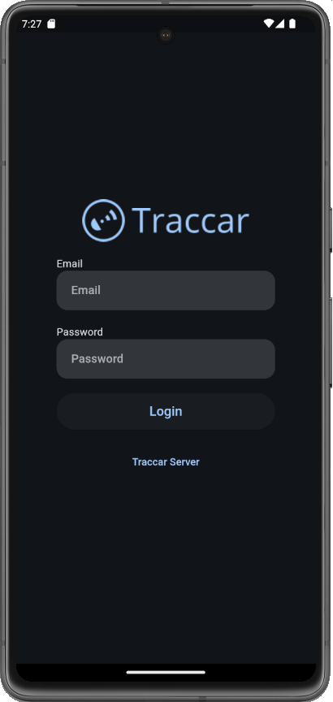 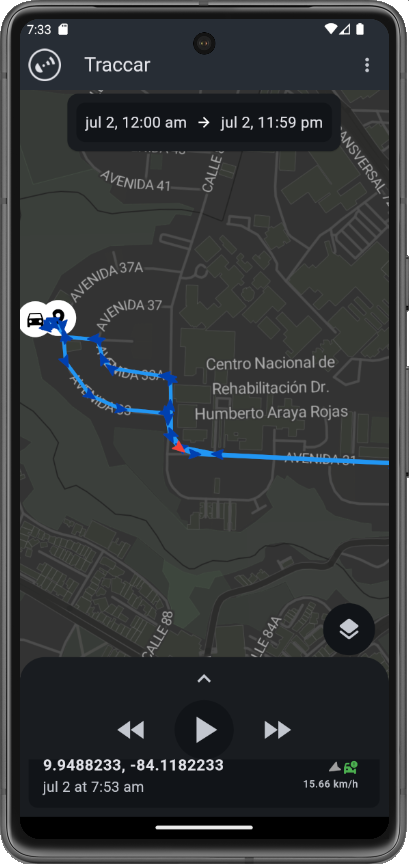

### iOS
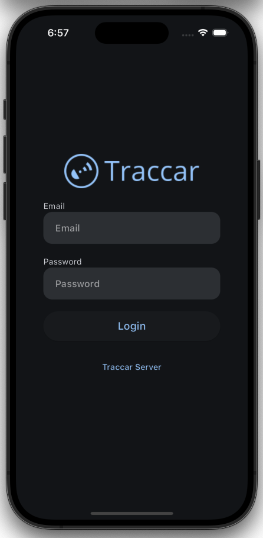 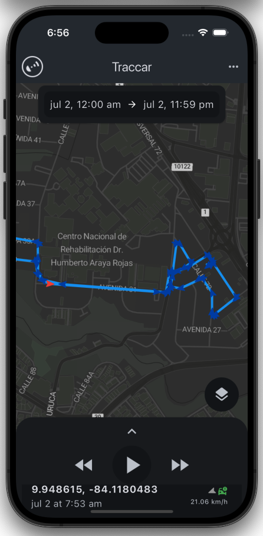

### Web
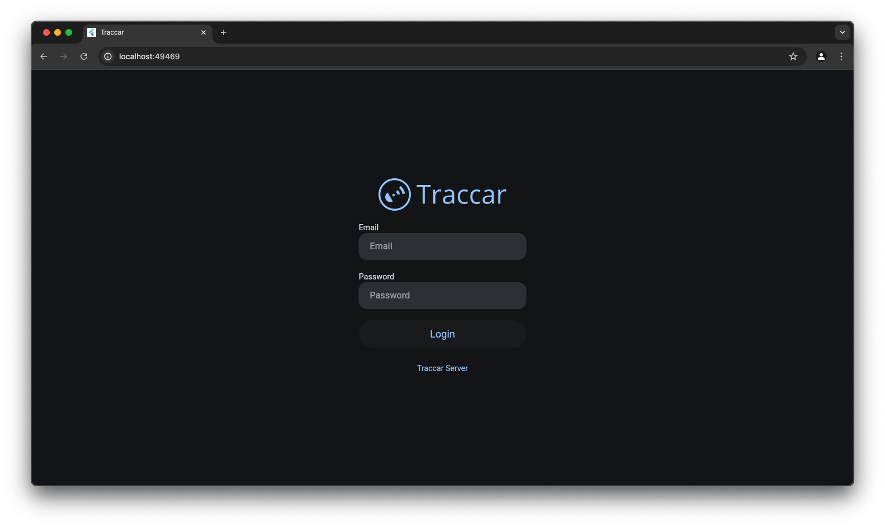 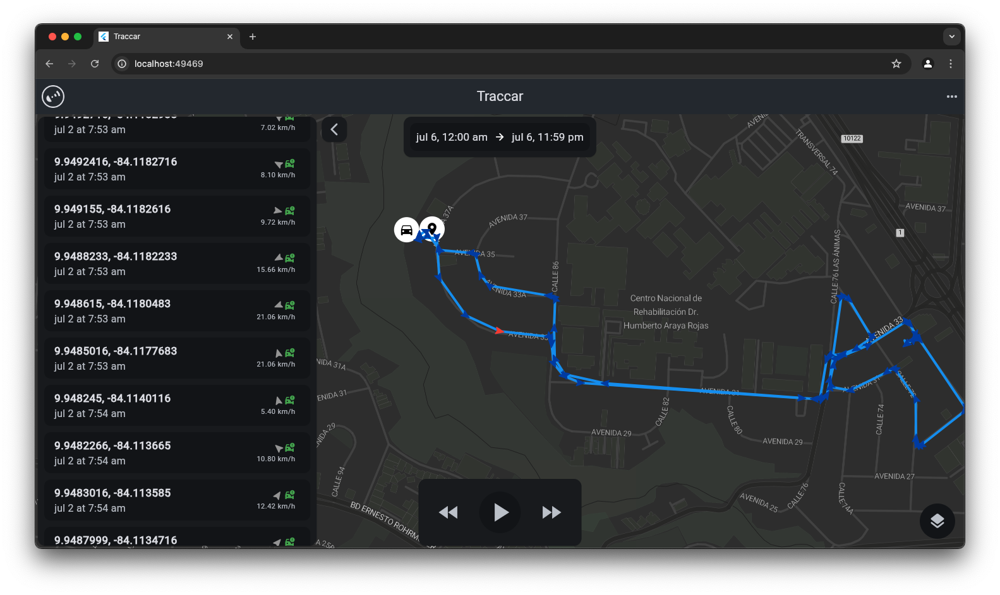

### Windows
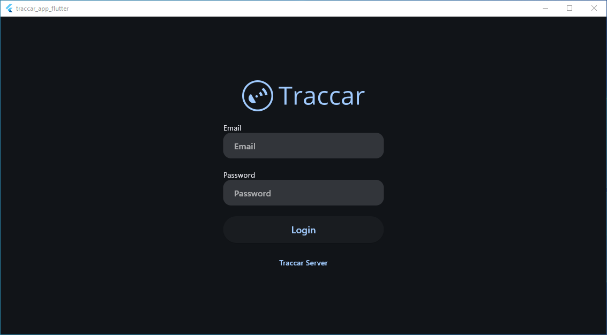 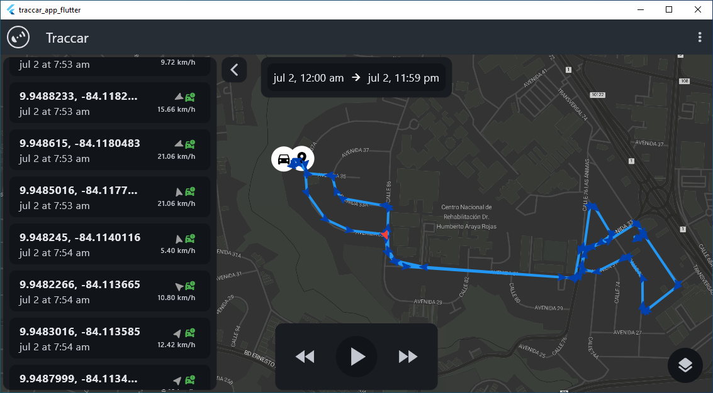

### Linux
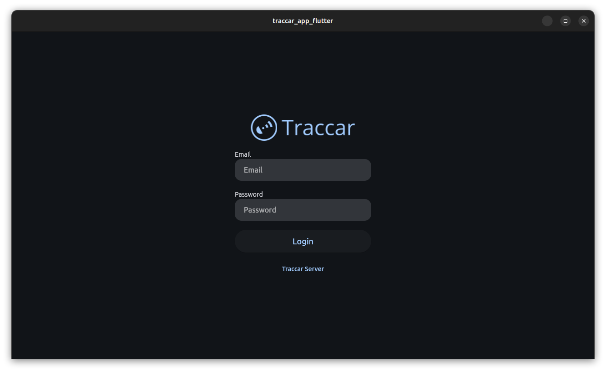 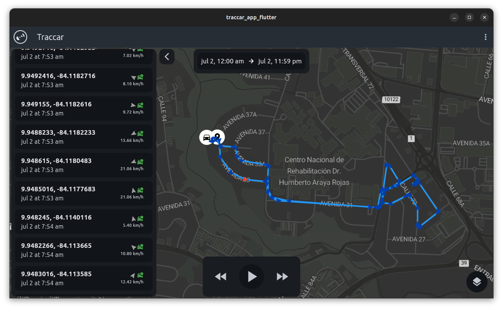

### macOS
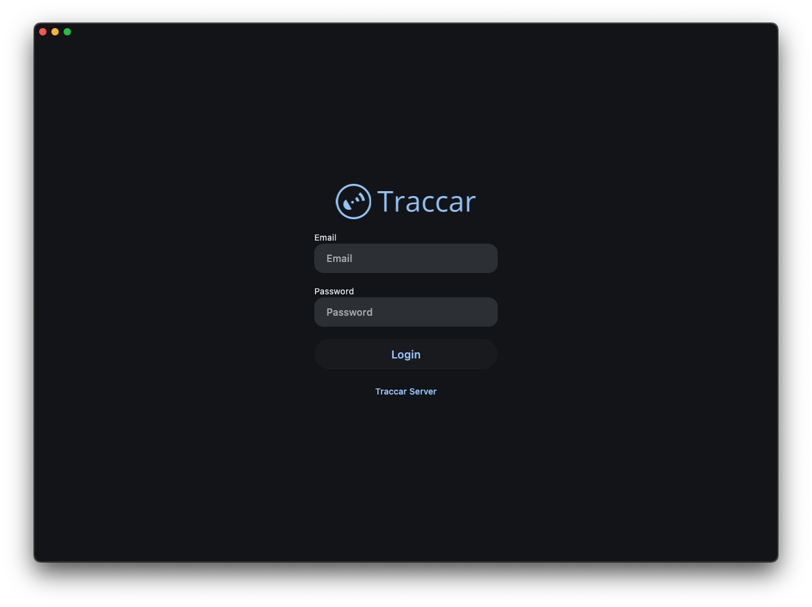 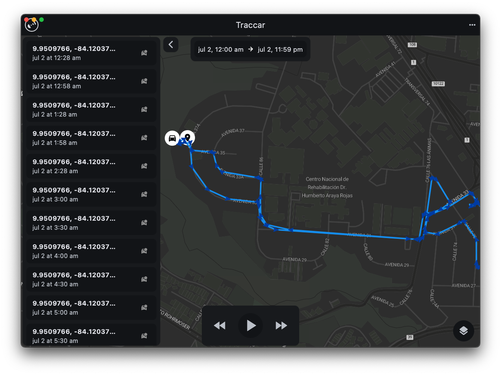

## Dark mode map providers
To use dark mode map providers [Stadia](https://stadiamaps.com/) you need to get an API key from their websites and add it to the `lib/utils/tile_providers.dart` file.